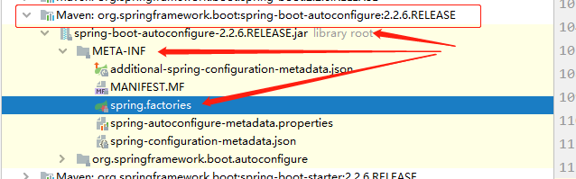
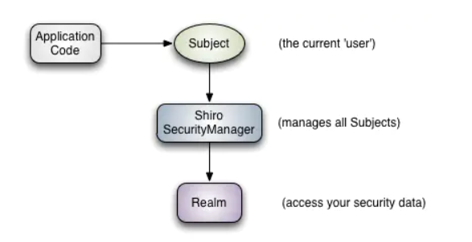
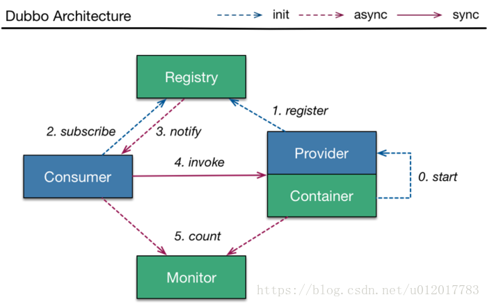

1. # 原理浅析

   ## 自动配置

   **启动器：**

   * spring-boot-dependencies：核心依赖在父工程中，在父工程中已经完成了大部分jar包的版本依赖，即我们在写或者引入一些SpringBoot依赖时， 不需要指定版本。

   **启动器：**

   SpringBoot的启动场景

   * ```xml
     <dependency>
         <groupId>org.springframework.boot</groupId>
         <artifactId>spring-boot-starter</artifactId>
     </dependency>
     ```

   * 如spring-boot-starter-web，会帮我们自动导入web环境所使用到的依赖

   * SpringBoot会将所用的功能场景都变成一个个启动器

   * 使用什么功能只需要找到对应的启动器就可以了

   **启动器：**

   ```java
   //标注此类是一个springboot的应用
   @SpringBootApplication
   public class HellowordApplication {
       //将SpringBoot启动
       public static void main(String[] args) {
           SpringApplication.run(HellowordApplication.class, args);
       }
   
   }
   ```

   * 注解

     * ```java
       @SpringBootConfiguration	//springboot的配置
       	@Configuration			//spring配置类
       		@Component			//本质任然是spring
       @EnableAutoConfiguration	//自动配置
       	@AutoConfigurationPackage	//自动配置包
       	@Import({AutoConfigurationImportSelector.class})
       								//自动配置导入选择
       
       //获取所有配置
       List<String> configurations = this.getCandidateConfigurations(annotationMetadata, attributes);
       ```

       获取获选配置

       ```
       protected List<String> getCandidateConfigurations(AnnotationMetadata metadata, AnnotationAttributes attributes) {
           List<String> configurations = SpringFactoriesLoader.loadFactoryNames(this.getSpringFactoriesLoaderFactoryClass(), this.getBeanClassLoader());
           Assert.notEmpty(configurations, "No auto configuration classes found in META-INF/spring.factories. If you are using a custom packaging, make sure that file is correct.");
           return configurations;
       }
       ```

       核心文件，META-INF/spring.factories

       

       

   **结论：**springboot所有自动配置都是在启动的时候扫描并加载`spring.factories`，所有的自动配置类

   都在这里面，但不一定生效，要判断条件是否成立（参数是否充足）（@ConditionalOnxxx()的参数是否曼珠）；只要导入了对应的start，就有了对应的启动器，自动装配就满足条件生效了。

   

   1. springboot在启动时，在类路径下（/META-INF/sping.factories）获取指定的值；
   2. 将这些自动配置的类导入容器，自动配置类进行配置生效；
   3. 以前我们需要手动配置的东西，现在springboot自动配置帮我们初始化了；
   4. 整合javaEE、解决方案呵自动配置的东西都在spring-boot-autoconfigure-2.2.6.RELEASE.jar包下；
   5. 他会将所有需要导入的组件，毅雷敏的方式返回，这些组件就会被添加到容器中；
   6. 其中文件中会有很多xxxAutoConfiguration的文件，就是这些类给容器中导入该场景所需要的所有组件，并自动配置（@Configuration）；
   7. 有了自动配置类，就不需要手动配置的过程

   

   ## 启动类

   启动类，SpringApplication，这个类主要做了一下四件事

   1. 推断应用的类型是普通项目还是web项目
   2. 查找并加载所有可用初始化配置，设置到initializers属性中
   3. 找出所有的应用程序监听器，设置到listeners属性中
   4. 推断并设置main方法的定义类，找到运行的主类

   

   ## 配置文件

   springboot的配置文件可以使用`application.properties`文件或`application.yaml`文件进行配置

   * application.properties
     * 语法结构：key=value
   * application.yaml
     * 语法结构：key: 空格value

   配置文件可以修改springboot的默认配置。properties只能存贮键值对；yaml可以存贮多种数据类型，但对空格要求及严格

   

   **配置文件赋值**

   yaml可以为实体类的属性赋值：在实体类添加`@ConfigurationProperties(prefix = "xxx")`注解，prefix 声明配置文件中的对象名；当然也可以不适用配置文件，可以在属性中使用`@Value("XX")`注解为属性赋值

   * 配置文件中可以使用SPEL表达式添加一些占位符，如${random.uuid}随机符、${random.int}随机数、${person.name:xiaoming}（person对象的name属性是否存在，空则默认使用xiaoming）

   * yaml所使用的`@ConfigurationProperties`中属性可以使用松散绑定，而porperties使用的`@Value`却不可以。松散绑定如下：

     ```java
     cat:
       first-name: 喵喵
       age: 3
     ```

     ```java
     @Component
     @ConfigurationProperties(prefix = "cat")
     public class Cat {
         private String firstName;
         private String age;
     }
     ```

     

   * 当然也可以使用`@PopertySource（Value="calsspath:XXX.yaml/XXXproperties")`注解为实体类加载指定的配置文件                                                                

   **由此我们可以将一些地址、编码、appID等属性和配置文件关联起来，javaConfig，使用起来更灵活。**  

   

   ### JSR-303校验

   使用用`@Validated `对实体类注解，再对相应的实现使用对应的校验注解，可以对数据赋值注入时对数据进行数据校验，在赋值时数据格式不正确则会报错。如：

   ```java
   @Validated  //数据校验
   public class Person {
       @Email(message = "邮箱格式错误")  //可以自定义错误信息
       private String email;
   }
   ```

   可以使用的校验方式有以下：

   | **Constraint**                | **详细信息**                                             |
   | :---------------------------- | :------------------------------------------------------- |
   | `@Null`                       | 被注释的元素必须为 `null`                                |
   | `@NotNull`                    | 被注释的元素必须不为 `null`                              |
   | `@AssertTrue`                 | 被注释的元素必须为 `true`                                |
   | `@AssertFalse`                | 被注释的元素必须为 `false`                               |
   | `@Min(value)`                 | 被注释的元素必须是一个数字，其值必须大于等于指定的最小值 |
   | `@Max(value)`                 | 被注释的元素必须是一个数字，其值必须小于等于指定的最大值 |
   | `@DecimalMin(value)`          | 被注释的元素必须是一个数字，其值必须大于等于指定的最小值 |
   | `@DecimalMax(value)`          | 被注释的元素必须是一个数字，其值必须小于等于指定的最大值 |
   | `@Size(max, min)`             | 被注释的元素的大小必须在指定的范围内                     |
   | `@Digits (integer, fraction)` | 被注释的元素必须是一个数字，其值必须在可接受的范围内     |
   | `@Past`                       | 被注释的元素必须是一个过去的日期                         |
   | `@Future`                     | 被注释的元素必须是一个将来的日期                         |
   | `@Pattern(value)`             | 被注释的元素必须符合指定的正则表达式                     |

   

   ### 多环境配置及配置文件位置

   * 配置文件位置

     可以写配置文件得位置有（优先级依次递减），yaml和properties通用：

     1.`file:/.config/`
     2.`file:./`
     3.`classpath:config/`
     4.`classpath:/`（默认位置）

     file指项目得根目录，classpath指resource路径。

   * 多文件配置

     * properties

       1. 先创建一个以`application-xxx.properties`的配置文件；

       2. 可以通过在默认的配置文件中`spring.profiles.active:XXX`来指定需要使用的配置文件。

   

   ### 配置文件能写些什么

   * `spring.factories`文件是源码文件，位于spring-boot-autoconfigure/meta-inf/spring.factories

   配置文件能够配置的东西，都存在一个xxxProperties文件，这类文件都有一个xxxAutoConfiguration的注解默认配置过。

   ​	xxxAutoConfiguration：默认配置值		

   ​	xxxProperties和配置文件绑定，我们在写配置就可以使用自定义的配置了。

   如要配置server.prot，就存在一个serverProperties文件，这个文件中的属性就可以自定义；并且这个文件被@ConfigurationProperties(prefix="server")注解，表示在spring.factories中是以server为前缀被自动配置过的

   #### 自动装配的原理

   1. SpringBoot启动时会加载大量的自动配置类；

   2. 写配置时我们看我们需要的功能有没有在SpringBoot默认写好的自动配置类当中；

   3. 如果没有，我们在来看这个自动配置类中到底配置了哪些组件；（只要我们要用的组件存在在其中，我们就不需要再手动配置了）

   4. 在给自动配置类添加组件的时候，会从properties类中获取某些属性。我们只需要在配置文件中指定这些属性的值即可；

      ```
      xxxAutoConfiguration：自动配置类，给容器添加组件
      
      xxxProperties：封装文件中相关属性。配置文件可以配置这些属性。
      ```

   特别：使用`debug: true` 这个配置，可以查看可以自动配置的组件是否在此容器中生效。

   * 条件满足时组件才会生效，条件是导入的依赖（如各种start）

   

   ## SpringBoot的一些注解

   ### @ConfigrationProperties和@value

   @ConfigrationProperties和@value，从配置文件中取值
@ConfigrationProperties对类，支持松散绑定，支持jsr303数据校验
   @value对具体属性，支持el语法
   
   *配置文件可以使用占位符、随机数以及引用*
   

   
   ### slf4j日志
   
   springboot的slf4j整合（代理）了常见的所有日志；项目在使用特定依赖时需要排除slf4j整合的日志
   
   日志级别trace、debug、info、warn、error；springboot默认是info级别，
   
   * 可以在配置文件中通过loging.level=xxx来控制日志输出级别；
   * 可以通过loging.file.path指定日志输出文件、甚至可以修改日志输出格式。
   * 也可以xml文件去配置（配置日志在指定环境输出）
   
   
   
   
   
   # SpringBoot Web开发
   
   > 回顾：SpringBoot帮我们配置了什么？我们能否对其进行修改？能改哪些？能不能对其扩展？
   >
   > * xxxAutoConfiguration：向容器中配置组件
   > * xxxProperties：自动配置类，装配的配置文件中可以自定义的内容！
   
   > 问题，我们i开发SpringBoot Web项目时需要解决的问题有：
   >
   > * 导入静态资源
   > * 设置首页
   > * 写页面（JSP或模板引擎Thymeleaf）
   > * 装配扩展SpringMVC
   > * 增删改查
   > * 国际化
   
   ## 静态资源导入
   
   WebMvcAutoCongifuration源码中的addResourceHandlers()方法
   
   ```java
           public void addResourceHandlers(ResourceHandlerRegistry registry) {
               if (!this.resourceProperties.isAddMappings()) {
                   logger.debug("Default resource handling disabled");
               } else {
                   Duration cachePeriod = this.resourceProperties.getCache().getPeriod();
                   CacheControl cacheControl = this.resourceProperties.getCache().getCachecontrol().toHttpCacheControl();
                   if (!registry.hasMappingForPattern("/webjars/**")) {
                       this.customizeResourceHandlerRegistration(registry.addResourceHandler(new String[]{"/webjars/**"}).addResourceLocations(new String[]{"classpath:/META-INF/resources/webjars/"}).setCachePeriod(this.getSeconds(cachePeriod)).setCacheControl(cacheControl));
                   }
   
                   String staticPathPattern = this.mvcProperties.getStaticPathPattern();
                   if (!registry.hasMappingForPattern(staticPathPattern)) {
                       this.customizeResourceHandlerRegistration(registry.addResourceHandler(new String[]{staticPathPattern}).addResourceLocations(WebMvcAutoConfiguration.getResourceLocations(this.resourceProperties.getStaticLocations())).setCachePeriod(this.getSeconds(cachePeriod)).setCacheControl(cacheControl));
                   }
   
               }
           }
   ```
   
   **总结：**在springboot中，我们可以使用一下方式处理静态资源
   
   1. webjars，访问localhost/8080/wejars/xxx
   2. pulic、static、resources、/**，访问localhost/8080/xxx
      * 优先级：resources > static(默认) > public
   
   
   
   ## 模板引擎（thymeleaf）
   
   1. 导入thymeleaf依赖
   
      ```java
              <!-- Thymeleaf Start -->
              <dependency>
                  <groupId>org.springframework.boot</groupId>
                  <artifactId>spring-boot-starter-thymeleaf</artifactId>
              </dependency>
              <!-- Thymeleaf End -->
      ```
   
   2. 将html页面放到temolates目录下即可
   
      thymeleafProperties部分源码：
   
      ```java
      	private String prefix = "classpath:/templates/";
          private String suffix = ".html";
      ```
   
   3. html页面做thymeleaf命名空间更改
   
      ```html
      <html xmlns:th="http://www.thymeleaf.org">
      ```
   
      thymeleaf可以使用html的所有标签，使用方法：给标签添加‘th:元素名'，如：
   
      ```html
      <div th:text="${msg}"></div>
      ```
   
   
   
   ### thymeleaf语法
   
   #### th属性
   
   html有的属性，Thymeleaf基本都有，而常用的属性大概有七八个。
    1.**th:text**  : 设置当前元素的文本内容，相同功能的还有**th:utext**，两者的区别在于前者不会转义html标签，后者会。
    2.**th:value**  : 设置当前元素的value值，类似修改指定html标签属性的还有**th:src**,**th:href**。
    3.**th:each**  : 遍历循环元素，和**th:text**或**th:value**一起使用。注意该属性修饰的标签位置，详细看后文。
    4.**th:if**  : 条件判断，类似的还有**th:unless，th:switch，th:case**。
    5.**th:insert** :  代码块引入，类似的还有**th:replace，th:include**，三者区别很大，若使用不恰当会破坏html结构，常用于公共代码块的提取复用。
    6.**th:fragment**  :  定义代码块，方便被**th:insert**引用。
    7.**th:object**  :  声明变量，一般和*{}一起配合使用，达到偷懒的效果。
   
    8.**th:attr**  :  修改任意属性，实际开发中用的较少，因为有丰富的其他th属性帮忙。
   
   #### 标准表达式语法
   
   变量表达式：``${...}``
   
   链接表达式：``@{...}``
   
   消息表达式：``#{...}``（国际化）
   
   代码块表达式：``~{...}``
   
   选择变量表达式：``*{...}``
   
   ***这里不过多叙述，更多自行查阅***
   
   ## MVC配置原理和扩展
   
   ### 视图解析器
   
   **springboot在配置组很多组件的时候，先看容器中是否有用户的配置（用户自己的配置需要注入到bean中），有用户的则使用用户的，否则使用默认配置。如下面自己配置一个视图解析器：**
   
   假如我们需要添加自己的视图解析器，查阅[官方文档](https://docs.spring.io/spring-boot/docs/2.3.0.RELEASE/reference/html/spring-boot-features.html#boot-features-spring-mvc-auto-configuration)后，有以下描述：
   
   ```java
   If you want to keep those Spring Boot MVC customizations and make more MVC customizations (interceptors, formatters, view controllers, and other features), you can add your own @Configuration class of type WebMvcConfigurer but without @EnableWebMvc.
   ```
   
   即：实现了视图解析器接口的类，就可以把这个类视作试图解析器（注解使用@Configuration切记不使用 @EnableWebMvc则可以扩展原来的视图解析器）
   
   ———>springboot组件的自动配置需要判断是否有用户自定义组件，若有则失效失效组件的自动配置（@EnableWebMvc），@Configuration是继承了自动配置组件
   
   
   
   自定以一个视图解析器
   
   ```java
   //扩展springMVC
   @Configuration
   public class MyMvcConfig implements WebMvcConfigurer {
   
       //自定一个自己的试图解析器
       public static class MyViewResolver implements ViewResolver{
           @Override
           public View resolveViewName(String s, Locale locale) throws Exception {
               return null;
           }
       }
   
       //将自定义的视图解析器放到bean中
      @Bean
       public ViewResolver myViewResolver(){
           return new MyViewResolver();
       }
   }
   ```
   
   
   
   源码中，`DispatcherServlet`类的`doDispatch(request, response)`方法，所有请求和响应都会经过这里，此处会选择适合的视图解析器，打断点DeBug后会发现我们自定以的视图解析器已经注入到其中了。
   
   
   
   ### 消息转换
   
   源码中，`WebMvcAutoConfiguration`类的`FormattingConversionService`控制了消息转换。而我们查看`WebMvcProperties`类的`dataFormat`属性，配置此属性(spring.mvc.data-format=xxx)可以修改默认的时间格式。
   
   
   
   ## 项目实例
   
   ### 首页配置
   
   所有页面的静态资源都需要使用thymeleaf接管
   
   * ```html
     <html xmlns:th="http://www.thymeleaf.org">
     ```
   
   * 注意thmelea语法
   
   ### 页面国际化
   
   1. 我们需要配置文i18n文件（i18n：international），对中文和英文的节点做翻译
   
   2. 我们如果需要在项目中进行按钮自动切换，我们就需要自定义组件`LocaleResolver`
   
      1. 写配置类（如：`MyLocaleResolver`)，实现LocaleResolver接口。在这个配置中完成：根据连接的参数设置国家，地区的设置
   
         ```java
         @Configuration
         public class MyLocaleResolver implements LocaleResolver {
             //解析请求
             @Override
             public Locale resolveLocale(HttpServletRequest request) {
                 //解析请求中的语言参数
                 String language = request.getParameter("language");
         
                 Locale locale = Locale.getDefault();    //  默认的
         
                 //如果请求连接的国际化语言参数为空
                 if (language!=null){
                     //zh_CN||en_US
                     String[] split = language.split("_");
                     //国家，地区
                     locale = new Locale(split[0],split[1]);
                 }
                 return locale;
             }
         
             @Override
             public void setLocale(HttpServletRequest request, HttpServletResponse response, Locale locale) {
             }
         }
         ```
   
      2. 记得将自己写的组件配置到spring容器中`@Bean`
   
         ```java
         @Bean
         public LocaleResolver localeResolver(){
             return new MyLocaleResolver();
         }
         ```
   
   3. 配置文件，将国际化配置文件的位置配置好
   
      ```java
      spring.messages.basename=i18n.login
      ```
   
      
   
   
   
   ### 登录
   
   写登录的业务流程类（如：`LoginController`），过程不赘述
   
   注意：在页面跳转时也可以使用视图跳转实现
   
   ​	`registry.addViewController("/index.html").setViewName("index");`
   
   
   
   ### 拦截器
   
   1. 在登录的业务流程中，登录成功则保存session。
   
      ```java
      session.setAttribute("loginUser",username);
      return "redirect:/main.html";
      ```
   
   2. 写拦截器配置类（如：`MyLoginHandlerInterceptor`），实现HandlerInterceptor接口。在配置中实现：判断有无登录成功的session，有的通过拦截器，否则返回错误信息返回首页不予通过）
   
      ```java
      @Configuration
      public class MyLoginHandlerInterceptor implements HandlerInterceptor {
          @Override
          public boolean preHandle(HttpServletRequest request, HttpServletResponse response, Object handler) throws Exception {
              System.out.println("------LoginHandlerInterceptor--------");
      
              //登录成功之后会保存session
              Object loginUser = request.getSession().getAttribute("loginUser");
      
              if (loginUser==null){   //用户未登录，重定向回主页
                  request.setAttribute("msg","没有权限，请先登录！");
                  request.getRequestDispatcher("/index.html").forward(request,response);
                  return false;
              }else {
                  return true;
              }
          }
      }
      ```
   
   3. 将拦截器组件配置到容器中，并配置拦截路径和不拦截路径
   
      ```jav
      //配置拦截器及拦截路径
      @Override
      public void addInterceptors(InterceptorRegistry registry) {
          registry.addInterceptor(new MyLoginHandlerInterceptor())
                  .addPathPatterns("/**")     //添加拦截的路径
                  .excludePathPatterns("/index.html","/","/user/login","/static/**");     //排除拦截的路径
      }
      ```
   
   
   
   ### 员工展示
   
   1. 提取公共页面
   
      * **th:fragment="XXX" 定义组件**
   
        `<nav th:fragment="sidebar"></nav>`
   
      * **th:insert="~{XX页面::xx组件名}**
   
        `<div th:insert="~{commons/nav::sidebar}"></div>`
   
      * **th:insert="~{XX页面::xx组件名}(XXX)传递参数给组件**
   
        `<div th:insert="~{commons/nav::sidebar(active='main.html')}"></div>`
   
   2. 循环展示
   
      **th:each="emp:${emps}**
   
      ```
      <tr th:each="emp:${emps}">
         <td th:text="${emp.getId()}"></td>
         <td>[[${emp.getLastName()}]]</td>
         <td th:text="${#dates.format(emp.getBirth(),'yyyy-MM-dd HH:mm:ss')}"></td>
      </tr>
      ```
   
      *通过`#dates.format(emp.getBirth(),'yyyy-MM-dd HH:mm:ss')`来对日期做格式化
   
   ### 添加员工
   
   1. 设置添加按钮
   
   2. 跳转至添加页面
   
      * 新增添加页面（设置name)
   
        **返回departments**
   
      * 在页面中将departments遍历到下拉框中(value是dept的id)
   
   3. 添加员工
   
      * *重定向到列表页面*
        * *redirect和forward可以在themleaf的视图解析器配置文件中做配置*
      * 时间的格式，*需要在配置`spring.mvc.format.date=yyyy-MM-dd`，默认为`dd/MM/yyy`
   
   4. 返回首页
   
   ###  修改信息
   
   1. 点击修改按钮
   
      * 页面按钮携带员工的id
   
        *注意链接跳转时参数携带方式*
   
   2. 跳转至员工信息页面（edit.html)
   
      ​		**根据id查询到员工页面返回**
   
      ​		*注意需要将部门信息也返回*
   
   3. 填写好修改的信息后提交
   
      * 将员工id不可丢失，赋到隐藏域中
   
   4. 跳转回list页面
   
      ​		**保存，返回list页面**
   
   
   
   ### 删除员工
   
   1. 删除按钮，附带id
      **根据ID底层删除**
   
   2. 返回list页面
   
      ​	**重定向到列表**
   
   
   
   ### 错误处理
   
   ​	将错误页面（404.html，500.html）放入error文件夹下，springboot会自动定向
   
   
   
   ### 注销
   
   ​	nav页面，点击注销按钮
      	 传入HttpSession，用`session.invalidate()`注销，然后重定向到登录页
   
   
   
   ### 开发总结
   
   #### 前端怎么写
   
   * 使用模板（模板之家），现成、美观
   
   * 使用框架：灵活。
   
     需要了解框架的栅格系统、导航栏、侧边栏、表单。其中组件，自己组合拼接
   
   #### 开发流程
   
   1. 设计前端的样子，确定所需数据
   2. 设计数据库##文件和图片的上传下载、富文本编辑
   3. 使前端能够独立运行，独立化工程
   4. 数据接口的对接：json、all in one
   5. 前后台联调测试
   
   #### 其他必要的
   
   1. 有一套自己熟悉的后台模板(x-admin)
   2. 前端界面，自己至少能通过前端框架，组合出一个网站页面(index、about、blog、post、user)
   3. 让这个网站能独立运行
   
   
   
   # SpringBoot整合
   
   ## 使用JDBC
   
   1. 引入依赖（pom）,或创建项目时勾选即可
   
      ```xml
      <dependency>
          <groupId>mysql</groupId>
          <artifactId>mysql-connector-java</artifactId>
      </dependency>
      ```
   
   2. 配置配置文件（application.yml）。如用户名、密码、数据库、数据源等
   
      配置为就可以获取数据源、连接等信息了。
   
      *假如报市区错误，配置文件中加上时间参数*
   
   3. 查看源码：
   
      * 能使用配置文件，则就就曾在XXXAutoConfig文件，即可查看配置的参数
      * xxxTemplate:SpringBoot已经配置好的模板bean，拿来即用，写了一些基本的CRUD
   
   4. 有了template后可以方便的使用CRUD了，如
   
      ```java
      @GetMapping("/userList")
      public List<Map<String, Object>> userList(){
          String sql = "select * from tb_user";
          List<Map<String, Object>> list_maps = jdbcTemplate.queryForList(sql);
          return list_maps;
      }
      ```
   
      *增和改也可以封装成Object对数据库操作（省略实体类）*
   
   ## 整合Druid
   
   1. 引入依赖，看源码
   
      ```xml
      <dependency>
          <groupId>com.alibaba</groupId>
          <artifactId>druid</artifactId>
      </dependency>
      ```
   
   2. 配置配置文件（datasource-username、password、url、type、其他池的配置（mysql配置修改数据源类型时druid即可）），如
   
   ```java
   spring:
     datasource:
       username: root
       password: root
       url: jdbc:mysql://localhost:3306/mp?serverTimezone=GMT&useUnicode=true&characterEncoding=utf-8
       driver-class-name: com.mysql.cj.jdbc.Driver
       type: com.alibaba.druid.pool.DruidDataSource
   ```
   
      *druid支持监控（支持filter.start、filter.log4j、filter.wall等日志）——引入log4j*
   
   3. 写`DruidConfig.class`配置druid
   
      0) 获取到数据源DataSource（使用`@ConfigurationProperties(prefix = "spring.datasource")`将配置文件中的配置读取进来）
   
      ```java
      @ConfigurationProperties(prefix = "spring.datasource")
      @Bean
      public DataSource druidDataSource() {
          return new DruidDataSource();
      }
      ```
   
      
   
      1）监控：获取serlet实例对象设置参数后注入Bean中
   
      * 使用`ServletRegistrationBean<StatViewServlet>`获取到bean实例
      * 然后通过Map.put设置参数以`bean.setInitParameters(xxx)`方式配置地址、、权限、用户名及密码等
      * *别忘了方法也需要注入到`@Bean`中*
   
      ```java
      //因为SpringBoot 内置了servlet容器，所以没有web.xml,代替方法是ServletRegistrationBean
      @Bean
      public ServletRegistrationBean statViewServlet() {
          ServletRegistrationBean<StatViewServlet> bean = new ServletRegistrationBean<>(new StatViewServlet(),"/druid/*");
      
          //后台需要有人登录，账号密码设置
          HashMap<String, String> initParameters = new HashMap<>();
          
          //添加配置
          initParameters.put("loginUsername","admin");    //登录的key是固定的 loginUsername和loginPassword
          initParameters.put("loginPassword","123456");
      
          //允许谁可以访问
          initParameters.put("allow","");
          //禁止谁访问
      //        initParameters.put("xiaoming","192.168.0.1");
      
          bean.setInitParameters(initParameters);   //设置初始化参数
          return bean;
      }
      ```
   
      此后别可以通过访问`locahost:8080/druid`查看监控了
   
      
   
      2）filter（过滤器）：获取serlet实例对象设置参数后注入Bean中(大致同上)
   
      + 获取FilterRegistrationBean<Filter>的获取到bean实例
      + 然后通过Map.put设置参数以`bean.setInitParameters(xxx)`方式配置过滤路径、排除路径等
      + *别忘了方法也需要注入到`@Bean`中*
   
      ```java
      //filter
      @Bean
      public FilterRegistrationBean wevStatFilter() {
          FilterRegistrationBean<Filter> bean = new FilterRegistrationBean<>();
          bean.setFilter(new WebStatFilter());
      
          //过滤的请求
          Map<String, String> initParameters = new HashMap<>();
      
          //排除统计的路径
          initParameters.put("exclusions","*.js,*.css,/druid/*");
      
          bean.setInitParameters(initParameters);
          return bean;
      }
      ```
   
   ## 整合MyBatis
   
   1. 引入依赖(pom)
   
   2. 写实体类、dao层mapper（记得使用`@Mapper`注解，或在启动类使用`@MapperScan("XXX")`注解）
   
   3. 写xml文件，编写sql，（头文件自行百度）
   
      * 写完后需要在配置文件中指定xml文件位置，如：
   
        `mybatis.mapper-locations=classpath:mybatis/mapper/*.xml`
   
      * 配置文件中不仅仅可以配置xml文件的位置，还可以指定，返回参数扫描的包等等（自行看源码），如
   
        `mybatis.type-aliases-package=com.bilibili.pojo`
   
   4. 写Controller接口文件，业务较简单可以先不写service层
   
   5. 运行，检查
   
   ## 整合SpringSecurity
   
   1引入pom依赖
   2写`xxxConfig.class`对其进行配置；继承`WebSecurityConfigurerAdapter`，别忘了加`@EnableWebSecurity`注解
   
   ### web-权限
   
   ①重写`configre(HttpSecurity http)`方法，（链式编程）使用http. authorizeRequest.(''/'xx') 添加授权页面
   ②也可使用http. fromLogin() 给未授权请求重定向到登录页（默认login页面）
   
   ```java
   @Override
   protected void configure(HttpSecurity http) throws Exception {
       //授权。规则：首页开放，功能页做权限校验
       http.authorizeRequests()
               .antMatchers("/").permitAll()
               .antMatchers("/level1/**").hasRole("vip1")
               .antMatchers("/level2/**").hasRole("vip2")
               .antMatchers("/level3/**").hasRole("vip3");
   
       //没有权限的定向到登录页
       //http.formLogin();
       http.formLogin().loginPage("/toLogin") //也可以指定登出成功页
               .usernameParameter("user").passwordParameter("pwd") //指定登录表单参数
               .loginProcessingUrl("/login");  //指定登录的url接口地址
       
       //关闭csrf功能
       http.csrf().disable();
       
       //注销，重定向到(/logout)
       //http.logout();
       http.logout().logoutSuccessUrl("/login"); //也可以指定登出成功页
       
       //记住我功能(cookie)
       http.rememberMe()
           .rememberMeParameter("remember");   //指定登录表单'记住我'参数，缺省值为'rememberMe'
   }
   ```
   
   
   
   #### web-记住我
   
   `http.rememberMe()`，SpringSecurity将信息存到了cookie中、
   
   #### web-注销
   
   接前节，使用`http.logout()`;可以选择（链式编程）可以清空coockie和session;还可以设置`http.logoutSuccessUrl`(注销后跳转的页面)
   
   #### web-权限控制
   
   1导包，（springsecrit有整合themyleaf的包）
    2前端编码
   	①sec:authentication="authorities"来判断用户权限
   	②也可以使用sec:authorize=(hasRole(xxx))来判断用户是否有角色权限
   	③SpringSecurity默认是开启防跨域请求的，可以通过http.crrf().disable()来关闭
   
   #### web-定制首页
   
   通过`http.fromLogin().loginPage("/toLogin")`来指定跳转的登录页（注意与前端请求接口保持一致，可以继续拼接，用`loginProcessUrl("/xxx")`指定到正确接口）
   *注意：登录表单参数不一定与SpringSecurity的默认相同，可以指定前端的参数(username和password)*
   
   remenberme同上
   
   
   
   ### web-认证
   
   ①重写`configr(AuthenticationManagerBuilder auth)`方法
   ②正常从数据库读。为方便这里从内存读，使用auth.innerMameryAuthentization((可以加加加密方式passwordencoder)). withUser ("usernmae").password("password"). role ("xxx")(链式编程) 
   
   ```java
   //认证，以内存方式
   @Override
   public void configure(AuthenticationManagerBuilder auth) throws Exception {
       //一般是从数据库中读取数据，也可以自定义从内存中读取（如下）
       auth.inMemoryAuthentication().passwordEncoder(new BCryptPasswordEncoder())  //编码加密
               .withUser("admin").password(new BCryptPasswordEncoder().encode("123456")).roles("vip1","vip2")
               .and()
               .withUser("root").password(new BCryptPasswordEncoder().encode("123456")).roles("vip1","vip2","vip3");
   }
   ```
   
   ```java
   //认证,以JDBC方式
   @Override
   public void configure(AuthenticationManagerBuilder auth) throws Exception {
       auth.dbcentication()
           .dataSource(datasouce)
           .withDefaulttScaheme()
           .withUser(users.username("username")).password("password").roles("USER")
           .withUser(users.username("username")).password("password").roles("USER","ADMIN")
   }
   ```
   
   
   
   ## 整合 Shiro
   
   ### shiro快速开始
   
   官网：https://shiro.apache.org
   
   
   
   1. 导入依赖，
   
      ```xml
      <dependency>
          <groupId>org.apache.shiro</groupId>
          <artifactId>shiro-core</artifactId>
          <version>1.6.0</version>
      </dependency>
      ```
   
   2. 配置文件。这是使用快速开始，数据从官方的shiro.ini中读取
   
      https://github.com/apache/shiro/blob/master/samples/quickstart/src/main/resources/shiro.ini
   
   3. 快速开始（HelloWorld）。此处使用官方例子（https://shiro.apache.org/10-minute-tutorial.html）：
   
      ```java
      public class Quickstart {
      
          private static final transient Logger log = LoggerFactory.getLogger(Quickstart.class);
      
          public static void main(String[] args) {
              Factory<SecurityManager> factory = new IniSecurityManagerFactory("classpath:shiro.ini");
              SecurityManager securityManager = factory.getInstance();
              SecurityUtils.setSecurityManager(securityManager);
              
      
              // get the currently executing user:
              //获取用户对象
              Subject currentUser = SecurityUtils.getSubject();
      
              // Do some stuff with a Session (no need for a web or EJB container!!!)
              //通过当前用户获取session
              Session session = currentUser.getSession();
              session.setAttribute("someKey", "aValue");
              String value = (String) session.getAttribute("someKey");
              if (value.equals("aValue")) {
                  log.info("Retrieved the correct value! [" + value + "]");
              }
      
              // let's login the current user so we can check against roles and permissions:
              //验证用户是否被认证
              if (!currentUser.isAuthenticated()) {
                  //通过name、password获取token；此处是从ini文件中读取
                  UsernamePasswordToken token = new UsernamePasswordToken("lonestarr", "vespa");
                  token.setRememberMe(true);  //记住我
                  try {   //执行登录操作
                      currentUser.login(token);
                  } catch (UnknownAccountException uae) { //用户名错误
                      log.info("There is no user with username of " + token.getPrincipal());
                  } catch (IncorrectCredentialsException ice) {   //密码错误
                      log.info("Password for account " + token.getPrincipal() + " was incorrect!");
                  } catch (LockedAccountException lae) {  //用户锁定
                      log.info("The account for username " + token.getPrincipal() + " is locked.  " +
                              "Please contact your administrator to unlock it.");
                  }
                  // ... catch more exceptions here (maybe custom ones specific to your application?
                  catch (AuthenticationException ae) {    //其他异常
                      //unexpected condition?  error?
                  }
              }
      
              //say who they are:
              //print their identifying principal (in this case, a username):
              //打印用户信息
              log.info("User [" + currentUser.getPrincipal() + "] logged in successfully.");
      
              //test a role:
              //测试用户角色
              if (currentUser.hasRole("schwartz")) {
                  log.info("May the Schwartz be with you!");
              } else {
                  log.info("Hello, mere mortal.");
              }
      
              //test a typed permission (not instance-level)
              //测试用户权限（粗粒度）
              if (currentUser.isPermitted("lightsaber:wield")) {
                  log.info("You may use a lightsaber ring.  Use it wisely.");
              } else {
                  log.info("Sorry, lightsaber rings are for schwartz masters only.");
              }
      
              //a (very powerful) Instance Level permission:
              //测试用户权限（细粒度）
              if (currentUser.isPermitted("winnebago:drive:eagle5")) {
                  log.info("You are permitted to 'drive' the winnebago with license plate (id) 'eagle5'.  " +
                          "Here are the keys - have fun!");
              } else {
                  log.info("Sorry, you aren't allowed to drive the 'eagle5' winnebago!");
              }
      
              //all done - log out!
              //注销
              currentUser.logout();
      
              //系统结束
              System.exit(0);
          }
      }
      ```
   
      重要代码：
   
      ```java
      Subject currentUser = SecurityUtils.getSubject(); //获取用户对象
      Session session = currentUser.getSession(); //通过当前用户获取session
      currentUser.isAuthenticated() //验证用户是否被认证
      currentUser.getPrincipal() ////获取用户信息
      currentUser.hasRole("schwartz") //测试用户角色
      currentUser.isPermitted("lightsaber:wield") //测试用户权限
      currentUser.logout(); //注销
      ```
   
   
   
   ### 整合Shiro
   
   #### 1. 导入依赖
   
   ```xml
   <dependency>
       <groupId>org.apache.shiro</groupId>
       <artifactId>shiro-spring</artifactId>
       <version>1.6.0</version>
   </dependency>
   ```
   
   #### 2.关联Shiro的三大核心
   
   实现关联Shiro的三大核心（Subject、SecurityManager、Realm），并编写Controller
   
   ```java
   @Configuration
   public class ShiroConfig {
   
       //ShrioFilterFactoryBean,具体实现看4
       @Bean
       public ShiroFilterFactoryBean getShiroFilterFactoryBean(DefaultWebSecurityManager manager) {
           ShiroFilterFactoryBean bean = new ShiroFilterFactoryBean();
           //关联安全管理器
           bean.setSecurityManager(manager);
           return bean;
       }
   
       //DeafaultWebSecurityManager
       @Bean
       public DefaultWebSecurityManager getDefaultWebSecurityManager(UserRealm userRealm) {
           DefaultWebSecurityManager manager = new DefaultWebSecurityManager();
           //关联UserRealm
           manager.setRealm(userRealm);
           return manager;
       }
   
       //创建 realm 对象,需要自定义类,具体实现看4
       @Bean
       public UserRealm userRealm() {
           return new UserRealm();
       }
   }
   ```
   
   其中`UserRealm`类需继承`AuthorizingRealm`并实现其方法
   
   ```java
   //自定义的Realm,具体实现看3
   public class UserRealm extends AuthorizingRealm {
       //授权
       @Override
       protected AuthorizationInfo doGetAuthorizationInfo(PrincipalCollection principalCollection) {
           System.out.println("=========授权================");
           return null;
       }
   
       //认证
       @Override
       protected AuthenticationInfo doGetAuthenticationInfo(AuthenticationToken token) throws AuthenticationException {
           System.out.println("===============认证==========");
           ///封装用户的登录数据
           return new null;
       }
   }
   ```
   
   #### 3.拦截（过滤器）
   
   用户在访问url时经过过滤器，未登录用户跳转指登录页。
   
   接2的`ShiroConfig`类的`ShiroFilterFactoryBean()`方法的具体实现：
   
   ```java
   //ShrioFilterFactoryBean
   @Bean
   public ShiroFilterFactoryBean getShiroFilterFactoryBean(DefaultWebSecurityManager manager) {
       ShiroFilterFactoryBean bean = new ShiroFilterFactoryBean();
       //关联安全管理器
       bean.setSecurityManager(manager);
   
       //关联shiro的内置过滤器
       /*
           anno:   无需认证就可以访问
           authc:  必须认证才能访问
           user:   必须拥有 记住我 功能才能用
           perms:  拥有对某个资源的权限才能访问
           role：   拥有某个角色权限才能访问
        */
       Map<String, String> filterMap = new LinkedHashMap<>();
       filterMap.put("/user/*", "authc");
       
       bean.setFilterChainDefinitionMap(filterMap);
       
       //设置登录请求
       bean.setLoginUrl("/toLogin");
       return bean;
   }
   ```
   
   #### 4.认证(整合MyBatis)
   
   ##### 认证
   
   用户登录，由`Controller`层经过登录认证。
   
   ```java
   @RequestMapping("/login")
   public String login(String username, String password, Model model) {
       //获取当前用户
       Subject subject = SecurityUtils.getSubject();
       //封装用户的登录数据
       UsernamePasswordToken token = new UsernamePasswordToken(username, password);
   
       try {
           subject.login(token);//执行登录，
           return "index";
       } catch (UnknownAccountException e){    //用户名不存在
           model.addAttribute("msg", "用户名错误");
           return "login";
       } catch (IncorrectCredentialsException e) { //密码错误
           model.addAttribute("msg", "密码错误");
           return "login";
       }catch (AuthenticationException e){
           model.addAttribute("msg", e.toString());
           return "login";
       }
   }
   ```
   
   具体的认证操作在`Realm`中实现：
   
   接2的`UserRealm`类的`doGetAuthenticationInfo()`方法的具体实现：
   
   ```java
   @Override
   protected AuthenticationInfo doGetAuthenticationInfo(AuthenticationToken token) throws AuthenticationException {
       System.out.println("===============认证==========");
   
       //用户名、密码（实际上应来自数据库）
       String name = "root";
       String password = "123456";
   
       UsernamePasswordToken userToken = (UsernamePasswordToken) token;
   
       if (!userToken.getUsername().equals(name)){
           return null;    //抛出异常：UnknownAccountException
       }
       //密码认证由shiro完成
       return new SimpleAuthenticationInfo("", password, "");
   }
   ```
   
   至此，用户经过过滤->登录->认证，然后可以访问授权了的页面了
   
   ##### 整合MyBatis
   
   1.添加依赖（jdbc、mysql、druid\log4j），并写配置（账户、密码、数据源、扫描包等），以及MVC层的代码
   
   2.改造Realm，是的该实体从数据库中获取用户名和密码（连接真是数据库）。从token中获取用户输入值，解析后到数据库中比对。
   
   ​	接上，`UserRealm`类的`AuthenticationInfo()`认证方法：
   
   ```java
   @Override
   protected AuthenticationInfo doGetAuthenticationInfo(AuthenticationToken token) throws AuthenticationException {
       System.out.println("===============认证==========");
       UsernamePasswordToken userToken = (UsernamePasswordToken) token;
   
       //用户名、密码（来自数据库）
       User user = userService.queryUserByName(userToken.getUsername());
       System.out.println("user = " + user);
       if (user == null){//账户不存在
           return null;    //抛出异常：UnknownAccountException
       }
   
       //可以选择密码加密方式（比如MD5,MD5盐值等等）
       //密码认证由shiro完成
       return new SimpleAuthenticationInfo("", user.getPassword(), "");
   }
   ```
   
   #### 5.授权
   
   注意与认证及认证失败的顺序。
   
   续4，在`ShiroConfig`设置类中的`ShiroFilterFactoryBean()`中设置授权和未授权的跳转页面`setUnauthorizedUrl("xxx")`，并在Contrller中补充接口
   
   ```java
   //ShrioFilterFactoryBean
   @Bean
   public ShiroFilterFactoryBean getShiroFilterFactoryBean(DefaultWebSecurityManager manager) {
       ShiroFilterFactoryBean bean = new ShiroFilterFactoryBean();
       //关联安全管理器
       bean.setSecurityManager(manager);
   
       //关联shiro的内置过滤器
       /*
           anno:   无需认证就可以访问
           authc:  必须认证才能访问
           user:   必须拥有 记住我 功能才能用
           perms:  拥有对某个资源的权限才能访问
           role：   拥有某个角色权限才能访问
        */
       //拦截，没登录跳到登录页面
       Map<String, String> filterMap = new LinkedHashMap<>();
   
       //授权,没有授权会跳到未授权页面
       filterMap.put("/user/add", "perms[user:add]");
       filterMap.put("/user/add", "perms[user:update]");
   
       filterMap.put("/user/*", "authc");
       bean.setFilterChainDefinitionMap(filterMap);
   
       //设置登录请求
       bean.setLoginUrl("/toLogin");
       //未授权页面
       bean.setUnauthorizedUrl("/noauth");
       return bean;
   }
   ```
   
   接上，在实体类`Realm`中在用户访问时从数据库中查找（此处直接从可以使用资源中获取）权限并赋予当前用户此权限`addStringPermission("xxx")`
   
   ```java
   //自定义的Realm
   public class UserRealm extends AuthorizingRealm {
   
       @Autowired
       UserService userService;
   
       //授权
       @Override
       protected AuthorizationInfo doGetAuthorizationInfo(PrincipalCollection principalCollection) {
           System.out.println("=========授权================");
   
           SimpleAuthorizationInfo info = new SimpleAuthorizationInfo();
   
           //拿到当前用户对象
           Subject subject = SecurityUtils.getSubject();
           User user = (User)subject.getPrincipal();
   
           //设置当前用户权限
           info.addStringPermission(user.getPerms());
   
           return info;
       }
   
       
       @Override
       protected AuthenticationInfo doGetAuthenticationInfo(AuthenticationToken token) throws AuthenticationException {
           System.out.println("===============认证==========");
           UsernamePasswordToken userToken = (UsernamePasswordToken) token;
   
           //用户名、密码（来自数据库）
           User user = userService.queryUserByName(userToken.getUsername());
           System.out.println("user = " + user);
           if (user == null){//账户不存在
               return null;    //抛出异常：UnknownAccountException
           }
   
           //可以选择密码加密方式（比如MD5,MD5盐值等等）
           //密码认证由shiro完成
           return new SimpleAuthenticationInfo(user, user.getPassword(), "");//可使用的资源，密码，实体对象
       }
   }
   ```
   
   #### 6.整合thymeleaf，完成注销
   
   依赖
   
   ```xml
   <!--shiro-thymeleaf-->
   <dependency>
       <groupId>com.github.theborakompanioni</groupId>
       <artifactId>thymeleaf-extras-shiro</artifactId>
       <version>2.0.0</version>
   </dependency>
   ```
   
   `Controller`类的注销接口
   
   ```java
   @RequestMapping("logout")
   public String logout() {
       Subject subject = SecurityUtils.getSubject();
       subject.logout();
       return  "index";
   }
   ```
   
   页面的简单实现
   
   ```html
   <body>
   <h1>首页</h1>
   <div shiro:notAuthenticated="">
       <a th:href="@{/login}">登录</a>
   </div>
   <div shiro:Authenticated="">
       <a th:href="@{/logout}">注销</a>
   </div>
   <p th:text="${msg}"></p>
   <hr/>
   
   <div shiro:hasPermission="user:add">
       <a th:href="@{/user/add}">add</a>
   </div>
   <div shiro:hasPermission="user:update">
       <a th:href="@{/user/update}">update</a>
   </div>
   
   </body>
   ```
   
   ## 整合Swagger
   
   >* Swagger是RestfulApiwendang 在线文档自动生产工具=>Api文档与API定义东部更新
   >* 直接运行，可以在线测试API接口；
   >* 支持多种语言
   
   1. 引入pom依赖
   
      ```xml
      <!--swagger-->
      <dependency>
          <groupId>io.springfox</groupId>
          <artifactId>springfox-boot-starter</artifactId>
          <version>3.0.0</version>
      </dependency>
      ```
   
   2. 编写配置类`SwaggerConfig`（记得添加注解），以及Controller层
   
      ```
      @Configuration
      @EnableSwagger2 //开启Swagger
      public class SwaggerConfig {
      }
      ```
   
      至此就已经可以运行项目了，http://localhost:xxxx/swagger-ui/index.html
   
   3. 配置Swagger接口
   
      可以配置多个`Docket`，过滤不同的api接口，以达到不同的分组（设置不同的
   
      ```java
      @Configuration
      @EnableSwagger2 //开启Swagger
      public class SwaggerConfig {
      
          @Bean
          public Docket getDocket(Environment environment) {
              //获取项目环境
              Boolean enableFlag = false;
              String[] activeProfiles = environment.getActiveProfiles();
              for (String profile : activeProfiles) {
                  if ("dev".equals(profile))  enableFlag=true;
              }
      
              return new Docket(DocumentationType.OAS_30)
                      .apiInfo(apiInfo())
                      //是否启用swagger
                      .enable(enableFlag) //根据当前运行环境决定是否开启
                  	//分组组名
                      .groupName("CK")
                      .select()
                      //RequestHandlerSelectors,配置要扫描接口的方式
                      //  basePackage()指定要扫描的包
                      //  any()都扫描
                      //  none()都不扫描
                      //  withClassAnnotation()扫描类上的注解
                      //  withMethodAnnotation()扫描方法上的注解
                      //          GetMapping()、PostMapper()
                      .apis(RequestHandlerSelectors.withMethodAnnotation(GetMapping.class))
                      //过滤xxx路径
                      //  ant()路径
      //                .paths(PathSelectors.ant("/"))
                      .build();
          }
      
          private ApiInfo apiInfo() {
              Contact contact = new Contact("作者", "主页地址", "邮箱地址");
              return new ApiInfo(
                      "Api 文档",
                      "Api 文档描述",
                      "1.0",
                      "https://space.bilibili.com/95256449/",
                      contact,
                      "Apache 2.0",
                      "http://www.apache.org/licenses/LICENSE-2.0",
                      new ArrayList());
          }
      
      ```
   
   }
   
      ```
      
      可以对各层的类和方法做注解（Controller、Entity......）
      
      如Controller层
      
      ```java
      /接口描述
      @Api(tags = "用户相关")
      @RestController
      public class Controller {
          @GetMapping(value = "/hello")
          public String hello() {
              return "hello";
          }
      
          //只要接口中存在实体类，接口就会被扫描到swagger中
          @ApiOperation("post测试")
          @PostMapping("/user")
          public User user(User user) {
              return new User();
          }
      
          //接口描述
          @ApiOperation("Hello控制类")
          @PostMapping("/hello")
          public String hello2(@ApiParam("用户名") String username) {
              return "index"+username;
          }
      }
      ```
   
      如Entity层
   
      ```java
      @ApiModel("用户实体类")
      public class User {
          @ApiModelProperty("用户名")
          public String name;
          @ApiModelProperty("密码")
          public String password;
      }
      ```
   
      如此便可在页面方便的使用Swagger做测试了，http://localhost:8080/swagger-ui/
   
   
   
   ## 任务（多线程）
   
   ### 异步任务
   
   在启动类上加`@EnableAsync`注解，开启异步功能；
   在需要异步的方法上加上`@Async`注解，当使用此方法是springboot既会自动使用异步方法去调用。
   
   ```java
   //模拟一个线程延迟
   @Async  //标识此此方法是异步的方法
   public void hello() {
       try {
           Thread.sleep(3000);
       } catch (InterruptedException e) {
           e.printStackTrace();
       }
       System.out.println("----数据正在处理。。。。。。------");
   }
   ```
   
   ### 邮件任务
   
   1. 导入pom依赖
   
      ```xml
      <dependency>
          <groupId>org.springframework.boot</groupId>
          <artifactId>spring-boot-starter-mail</artifactId>
      </dependency>
      ```
   
   2. 配置配置文件（用户名、密码（授权码）、主机等.....(QQ邮箱需要加密验证配置)
   
   3. 编写业务代码。设置标题、内容、收件人等
   
      ```java
      @Test
      void contextLoads() {
          //一个简单邮件
          SimpleMailMessage message = new SimpleMailMessage();
          message.setSubject("通知");   //主题
          message.setText("Thanks for you test!");    //内容
          message.setTo("ckisaboy@qq.com");   //收件人
          message.setFrom("ckisaboy@qq.com"); //发件人
      
          mailSender.send(message);
      }
      ```
   
   4. 可以使用复杂构造，去实现复杂的邮件内容。设置标题、内容（及格式）、附件、收件人等
   
      ```java
      @Test
      void contextLoads2() throws MessagingException {
          //一个复杂邮件
          MimeMessage mimeMessage = mailSender.createMimeMessage();
      
          //组装
          MimeMessageHelper helper = new MimeMessageHelper(mimeMessage, true);
      
          //正文
          helper.setSubject("公告");
          helper.setText("<p style='color:red'>Thanks for U look it!</p>");
      
          //附件
          helper.addAttachment("1.jpg",new File("X:/img/1.jpg"));
      
          helper.setTo("ckisaboy@qq.com");   //收件人
          helper.setFrom("ckisaboy@qq.com"); //发件人
      
          mailSender.send(mimeMessage);
      }
      ```
   
   ### 定时任务（timer)
   
   在启动类上加`@EnableScheduling`注解，开启定时功能；
   
   在需要异步的方法上加上`@AsyncSchedued(cron=xxx)`注解，标注此方法是定时任务，且定时器满足cron表达式
   
   *底层是实现了`TaskScheduler`、`TaskExcutor`这两个接口来实现定时（再底层使用了`Runable`接口）*
   
   ```java
   TaskScheduler	//任务调度者
   TaskExcutor		//任务执行者
   
   @EnableScheduledAutoConfig	//开启定时任务
   @Scheduled(cron=xxx)	//标注此方法是定时任务
   cron表达式
   ```
   
   
   
   
   
   ## 缓存(Cache)
   
   1. 引入pom依赖
   
   2. 在启动类中开启缓存，`@EnableCaching`。表示开启缓存功能
   
   3. 在需要缓存数据的方法上添加`@Cacheable`，（key不用能"#result“)
   
      `@Cacheable`的几个属性
   
      * cacheName/value：指定缓存组件的名字
   
      * key：指定缓存数据使用的key，默认是方法的参数的值(1-"张三")
   
        *可以使用SpEL表达式：#id(参数名)	#a0(第1个参数)	#p0(第1个参数)	#root.arg[0](第1个参数)*
   
      * keyGenerator：key生成器，可以指定ket的生成器的组件id；key/keyGenerator二选一使用
   
      * cacheManager：指定缓存管理器，或者指定cacheResolver缓存解析器
   
      * conditioin：指定符合体哦阿健的情况下才缓存，`@Cacheable(cacheNames = {"user"}, condition = "#id>0")`
   
      * unless：否定缓存，unless指定的条件为true，方法返回值就不被缓存（可以对结果进行判断）`unless="#result==null"`
   
      * sync：是否使用异步模式，异步时不支持unless
   
   4. 其他注解
   
      * `@CachePut`既调用方法，又更新缓存数据；先调用方法，再缓存结果
   
        使用时注意指定key，如`@CachePut(value="user", key="#result.id")`，将返回值的id作为key
   
      * `@ChacheEvict`缓存清除
   
        除了可以指定cacheName/value和key属性以外，
   
        allEntries属性，可以指定是否清除全部缓存
   
        beforeInvocation属性，可以指定是否在方法执行之前执行，默认为false。关闭时，在方法异常时缓存不会清楚
   
      * `@Chaching`定义复杂缓存
   
        指定存缓存、缓存的触发属性
   
        ```java
        @Caching(
                cacheable = {//缓存中有，则不会执行方法
                        @Cacheable(value = "user", key = "#name")
                },
                put = {	//因为更新缓存在方法之后，所以在查id和password一定会执方法
                        @CachePut(value = "user", key = "#result.id"),
                        @CachePut(value = "user", key = "#result.password")
                }
        )
        public User findUserByname(String name){...}
        ```
   
   5. `@CacheConfig`
   
      可以抽取缓存中的公共配置，如（`@CacheConfig(cacheNames="user")`，则方法的注解中不必再添加cacheName/value属性
   
   
   
   ## 整合RabbitMQ
   
   ### 概述
   
   生产者-----生成消息(指定路由键)-------->交换器（通过管理队列(消息)）<-----消费消息(凭借路由键)-------消费者
   
   > 交换器(Exchange)分类
   >
   > * direct点对点：将加息发送给绑定的指定队列
   > * fanout广播：将消息发送给绑定的所有队列
   > * topic主题：将消息发送给绑定的符合规则的队列
   
   1. 准备MQ，在服务器上安装MQ，用来存放消息队列。
   2. 分别创建交换器、消息队列，并将交换器以不同规则和路由键与队列绑定
   3. 然后就可以生成消息和消费消息了
   
   ### 整合RabbitMQ
   
   1. 引入依赖（pom）,或创建项目时勾选即可
   
      ```xml
      <dependency>
          <groupId>org.springframework.boot</groupId>
          <artifactId>spring-boot-starter-amqp</artifactId>
      </dependency>
      <dependency>
          <groupId>org.springframework.amqp</groupId>
          <artifactId>spring-rabbit-test</artifactId>
          <scope>test</scope>
       </dependency>
      ```
   
   2. 编写MQ相关配置，如主机地址、用户名和密码，端口默认是5672
   
      ```properties
      spring.rabbitmq.host=localhost
      spring.rabbitmq.username=guest
      spring.rabbitmq.password=guest
      ```
   
   3. 使用自动注入一个`RabbitTemplate`实例来对MQ操作（可以类比JDBCTeamplate）
   
   4. 发送消息
   
      1. 以direct(单播)的方式发送消息
   
         ```java
         @Autowired
         RabbitTemplate rabbitTemplate;
         
         /**
          * 1.diret单播（点对点）
          */
         @Test
         void directTest() {
             //message需要自己构造，定义消息体内容和消息头
             //rabbitTemplate.convertAndSend(exchange, routerKey, message);
         
             //object为默认消息体，传入要发送的对象，自动序列化发送个rabbitmq
             //rabbitTemplate.convertAndSend(exchange, routerKey, message);
         
             Map<String, Object> map = new HashMap<>();
             map.put("msg", "消息");
             map.put("data", Arrays.asList("hello", 123, "world", true));
             rabbitTemplate.convertAndSend("exchange.direct", "bilibili.news", map);
         
         }
         ```
   
      2. 以fonout(广播)的凡是发送消息
   
         *可以修改默认序列化的方式*
   
         ```java
         @Autowired
         RabbitTemplate rabbitTemplate;
         
         /**
          * 2fonout广播
          */
         @Test
         void fonout广播Test() {
             rabbitTemplate.convertAndSend("exchange.direct", "bilibili.news", new User("YBM", "委员长"));
         }
         ```
   
      3. 
   
      4. 
   
   5. 接收消息
   
      ```java
      @Test
      void receive() {
          Object o = rabbitTemplate.receiveAndConvert("bilibili.news");
          System.out.println(o.getClass());
          System.out.println(o);
      }
      ```
   
      可以修改AMQP的一些默认设置如下，（记得注入到**Bean**中如）
   
      ```java
      @Configuration
      public class MyAMQPConfig {
          /** 替换AMQP默认的序列化方式为json */
          @Bean
          public MessageConverter messageConverter() {
              return new Jackson2JsonMessageConverter();
          }
      }
      ```
   
   6. 监听消息队列
   
      不仅可以接收消息，还可以对消息队列进行监听（基于注解）
   
      在启动类中使用`@EnableRabbit`，在方法上使用`@RabbitListener(queues = "XXX")`，如
   
      ```java
      @Service
      public class UserSerice {
          @RabbitListener(queues = "bilibili.news")
          public void receive(User user){
              System.out.println("接收到消息user：" + user);
          }
      
          @RabbitListener(queues = "bilibili")
          public void receive(Message message){
              //消息头
              System.out.println("message.getMessageProperties() = " + message.getMessageProperties());
              //消息体
              System.out.println("message.getBody() = " + message.getBody());
          }
      }
      ```
   
   7. 通过amqpAdmin管理amqp
   
      通过AmqpAdmin实例进行管理
   
      ```java
      @SpringBootTest
      class Springboot11AmqpApplicationTests {
          @Autowired
          AmqpAdmin amqpAdmin;
      
          @Test
          void createExchange() {
              //创建exchange
              amqpAdmin.declareExchange(new DirectExchange("amqpadmin.exchange"));
      
              //创建消息队列
              amqpAdmin.declareQueue(new Queue("amqpadmin.queue", true));
      
              //创建绑定规则
              amqpAdmin.declareBinding(new Binding(
                      "amqpadmin.queue",  //地址
                      Binding.DestinationType.QUEUE,  //消息队列
                      "amqpadmin.exchange",   //交换器
                      "amqp.binding",     //路由键
                      null));
          }
      }
      ```
   
   
   
   ## 整合Dubbo(Zookeeper)
   
   
   
   架构
   
   
   
   1. 注册中心(Register)。下载安装zookeeper并启动，即启动注册中心。可以是远程主机也可以是本地，默认使用2181端口。
   
   2. 提供者(provider)。提供者需要将自己提供的服务注册到注册中心(zookeeper)。
   
      1. 新建提供者项目，引入dubbo、zookeeper和zkclient相关依赖
   
         ```xml
         <!--dubbo-->
         		<dependency>
         			<groupId>org.apache.dubbo</groupId>
         			<artifactId>dubbo-spring-boot-starter</artifactId>
         			<version>2.7.7</version>
         		</dependency>
         		<dependency>
         			<groupId>org.apache.curator</groupId>
         			<artifactId>curator-framework</artifactId>
         			<version>4.0.1</version>
         		</dependency>
         		<dependency>
         			<groupId>org.apache.curator</groupId>
         			<artifactId>curator-recipes</artifactId>
         			<version>2.8.0</version>
         		</dependency>
         
         		<!--zookeeper-->
         		<dependency>
         			<groupId>org.apache.zookeeper</groupId>
         			<artifactId>zookeeper</artifactId>
         			<version>3.4.10</version>
         			<exclusions>
         				<exclusion>
         					<groupId>org.slf4j</groupId>
         					<artifactId>slf4j-log4j12</artifactId>
         				</exclusion>
         				<exclusion>
         					<groupId>log4j</groupId>
         					<artifactId>log4j</artifactId>
         				</exclusion>
         			</exclusions>
         		</dependency>
         		<!--zookeeper客户端
         			日志冲突，排除日志
         		-->
         		<dependency>
         			<groupId>com.101tec</groupId>
         			<artifactId>zkclient</artifactId>
         			<version>0.11</version>
         			<exclusions>
         				<exclusion>
         					<groupId>org.slf4j</groupId>
         					<artifactId>slf4j-log4j12</artifactId>
         				</exclusion>
         			</exclusions>
         		</dependency>
         ```
   
      2. 编写配置文件，配置服务应用名、注册中心地址、dubbo要扫描等信息
   
         ```properties
         # 服务应用名
         dubbo.application.name=provider-server
         # 注册中心地址
         dubbo.registry.address=zookeeper://localhost:2181
         # 注册扫描的包
         dubbo.scan.base-packages=com.bilibili.tickt.service
         ```
   
      3. 在需要发布的服务的类上使用`@DubboService`注解，运行时就会将服务发布到注册中心
   
         *务必写服务的接口，消费者需要通过接口来调用服务*
   
         ```java
         @DubboService   //发布到注册中心
         public class TicketServiceImpl implements TicketService {
             /** 提供票的服务 */
             @Override
             public String getTicket() {
                 return "《TENET》";
             }
         }
         ```
   
      4. 
   
      5. 
   
   3. 消费者(consumer)。消费者向注册中心获取到服务地址并到此地址获取提供者提供的服务。
   
      1. 新建消费者项目，引入dubbo、zookeeper和zkclient相关依赖（同提供者）
   
      2. 编写配置文件
   
         ```properties
         # 服务应用名
         dubbo.application.name=consumer-server
         # 注册中心地址
         dubbo.registry.address=zookeeper://localhost:2181
         ```
   
      3. 消费者调用的提供者提供的服务
   
         1. 写（复制）提供者服务的抽象接口
   
            ```java
            public interface TicketService {
                public String getTicket();
            }
            ```
   
         2. 编写消费者的引用接口
   
            ```java
            @Service
            public class UserService {
                @DubboReference //声明提供者的服务
                TicketService ticketService;
            
                public void hello() {
                    String ticket = ticketService.getTicket();
                    System.out.println("买了票了，"+ticket);
                }
            }
            ```
   
      4. 测试
   
         ```java
         @Autowired
         UserService userService;
         
         @Test
         void contextLoads() {
             userService.hello();
         }
         ```
   
         结果
   
         ```java
         买了票了，《TENET》
         ```
   
         
   
   