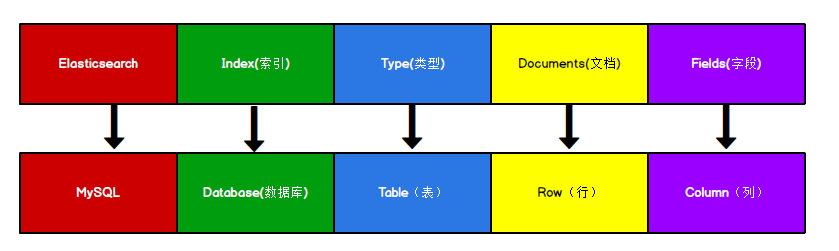

# ElasticSearch
> 参考:  
> 1. [【尚硅谷】ElasticSearch教程入门到精通（基于ELK技术栈elasticsearch 7.8.x版本）](https://www.bilibili.com/video/BV1hh411D7sb)
> 2. [Elasticsearch学习笔记](https://blog.csdn.net/u011863024/article/details/115721328)


## 概述
**Elasticsearch 是什么**  
The Elastic Stack, 包括 Elasticsearch、 Kibana、 Beats 和 Logstash（也称为 ELK Stack）。能够安全可靠地获取任何来源、任何格式的数据，然后实时地对数据进行搜索、分析和可视化。
Elaticsearch，简称为 ES， ES 是一个开源的高扩展的分布式全文搜索引擎， 是整个 ElasticStack 技术栈的核心。
它可以近乎实时的存储、检索数据；本身扩展性很好，可以扩展到上百台服务器，处理 PB 级别的数据。

**全文搜索引擎**  
Google，百度类的网站搜索，它们都是根据网页中的关键字生成索引，我们在搜索的时候输入关键字，它们会将该关键字即索引匹配到的所有网页返回；还有常见的项目中应用日志的搜索等等。对于这些非结构化的数据文本，关系型数据库搜索不是能很好的支持。

一般传统数据库，全文检索都实现的很鸡肋，因为一般也没人用数据库存文本字段。进行全文检索需要扫描整个表，如果数据量大的话即使对 SQL 的语法优化，也收效甚微。建立了索引，但是维护起来也很麻烦，对于 insert 和 update 操作都会重新构建索引。 

基于以上原因可以分析得出，在一些生产环境中，使用常规的搜索方式，性能是非常差的：

* 搜索的数据对象是大量的非结构化的文本数据。
* 文件记录量达到数十万或数百万个甚至更多。
* 支持大量基于交互式文本的查询。
* 需求非常灵活的全文搜索查询。
* 对高度相关的搜索结果的有特殊需求，但是没有可用的关系数据库可以满足。
* 对不同记录类型、非文本数据操作或安全事务处理的需求相对较少的情况。为了解决结构化数据搜索和非结构化数据搜索性能问题，我们就需要专业，健壮，强大的全文搜索引擎 。

这里说到的全文搜索引擎指的是目前广泛应用的主流搜索引擎。它的工作原理是计算机索引程序通过扫描文章中的每一个词，对每一个词建立一个索引，指明该词在文章中出现的次数和位置，当用户查询时，检索程序就根据事先建立的索引进行查找，并将查找的结果反馈给用户的检索方式。这个过程类似于通过字典中的检索字表查字的过程。


## Elasticsearch入门
> 官方网址: https://www.elastic.co/cn/
> 官方文档: https://www.elastic.co/guide/index.html

### 准备
#### 下载并启动Elasticsearch
    Windows 版的 Elasticsearch 压缩包，解压即安装完毕，解压后的 Elasticsearch 的目录结构如下 ：
    | 目录 | 含义 |
    | -- | -- |
    | bin | 可执行脚本目录 |
    | config | 配置目录|
    | jdk | 内置 JDK 目录|
    | lib | 类库|
    | modules | 模块目录|
    | plugins | 插件目录|
    解压后，进入 bin 文件目录，点击 elasticsearch.bat 文件启动 ES 服务 。

    注意: 启动后会显示默认账号Elasticsearch的密码
    增加用户密码和SSL对于初学来说，徒增不必要的麻烦,这里直接干掉:
    config/elasticsearch.yml
    ```yaml
    xpack.security.enabled: false
    以及
    xpack.security.http.ssl:
        enabled: false
    ```

    注意： 9300 端口为 Elasticsearch 集群间组件的通信端口， 9200 端口为浏览器访问的 http协议`RESTful`端口。

    打开浏览器，输入地址： `http://localhost:9200`，测试返回结果, 正常访问即启动成功.

    * RESTful 测试工具
        这里推荐使用`Apifox`, 官网: https://www.apifox.cn/

#### 数据格式
    Elasticsearch 是面向文档型数据库，一条数据在这里就是一个文档。 为了方便大家理解，我们将 Elasticsearch 里存储文档数据和关系型数据库 MySQL 存储数据的概念进行一个类比
    
    ES 里的 Index 可以看做一个库，而 Types 相当于表， Documents 则相当于表的行。这里 Types 的概念已经被逐渐弱化， Elasticsearch 6.X 中，一个 index 下已经只能包含一个type， Elasticsearch 7.X 中, Type 的概念已经被删除了。

    **倒排索引**  
    传统的正排索引
    | id | content |
    | -- | -- |
    | 1001 | my name is zhangsan |
    | 1002 | my name is lisi |

    ES的倒排索引
    |keyword|id|
    |--|--|
    |name|1001, 1002|
    |zhang|1001|

#### HTTP-操作
1. 索引-创建
    对比关系型数据库，创建索引就等同于创建数据库。

    向 ES 服务器发`PUT`请求 ： `http://127.0.0.1:9200/shopping`
    请求后，服务器返回响应：
    ``` json
    {
        "acknowledged": true,
        "shards_acknowledged": true,
        "index": "shopping"
    }
    ```
    这样表示成功, 如果再次请求会提示`已存在`

    查看后台有` [shopping] creating index, cause [api], templates [], shards [1]/[1]`

2. 索引-查询&删除  
    * 查询单个索引
    向 ES 服务器发`GET`请求 ： `http://127.0.0.1:9200/shopping`, 返回结果: 
    ``` json
    {
        "shopping": {   // 索引名
            "aliases": {},  // 别名
            "mappings": {}, // 映射
            "settings": {   // 设置
                "index": {  // 设置-索引
                    "routing": {        // 设置-索引路由
                        "allocation": {
                            "include": {
                                "_tier_preference": "data_content"
                            }
                        }
                    },
                    "number_of_shards": "1",
                    "provided_name": "shopping",
                    "creation_date": "1656561245711",   // 设置-索引-创建时间
                    "number_of_replicas": "1",
                    "uuid": "N5a6epUoSVi3qis7wQFo3w",
                    "version": {
                        "created": "8030099"
                    }
                }
            }
        }
    }
    ```

    * 查询所有索引
        向 ES 服务器发`GET`请求 ： `http://127.0.0.1:9200/_cat/indices?v`
        这里请求路径中的_cat 表示查看的意思， indices 表示索引，所以整体含义就是查看当前 ES服务器中的所有索引，就好像 MySQL 中的 show tables 的感觉，服务器响应结果如下 :
        ```
        health status index    uuid                   pri rep docs.count docs.deleted store.size pri.store.size
        yellow open   shopping N5a6epUoSVi3qis7wQFo3w   1   1          0            0       225b           225b
        ```  
        |表头|含义|
        |--|--|
        | health	| 当前服务器健康状态： green(集群完整) yellow(单点正常、集群不完整) red(单点不正常)|
        |status	| 索引打开、关闭状态|
        |index	| 索引名|
        ||uuid	| 索引统一编号|
        |pri	| 主分片数量|
        |rep	| 副本数量|
        |docs.count	| 可用文档数量|
        |docs.deleted	| 文档删除状态（逻辑删除）|
        |store.size	| 主分片和副分片整体占空间大小|
        |pri.store.size	| 主分片占空间大小|  

    * 删除索引
    向 ES 服务器发`DELETE`请求 ： `http://127.0.0.1:9200/shopping`, 返回结果: 
    ``` json
    {
        "acknowledged": true
    }
    ```
    再次查看索引, 已经没有 shopping 了


假设索引已经创建好了，接下来我们来创建文档等操作。
这里的文档可以类比为关系型数据库中的表数据，添加的数据格式为 JSON 格式  

4. 文档-创建
    向 ES 服务器发`POST`请求 ： `http://127.0.0.1:9200/shopping/_doc`，请求体JSON内容为：
    ``` json
    {
        "title":"小米手机",
        "category":"小米",
        "images":"http://www.gulixueyuan.com/xm.jpg",
        "price":3999.00
    }
    ```
    注意: 指定请求体的格式为JSON(application/json)
    返回结果:
    ``` json
    {
        "_index": "shopping",   // 索引
        "_type": "_doc",    // 类型-文档
        "_id": "ANQqsHgBaKNfVnMbhZYU",  // 唯一标识，可以类比为 MySQL 中的主键，随机生成
        "_version": 1,  // 版本
        "result": "created",    // 结果，这里的 create 表示创建成功
        "_shards": {
            "total": 2,
            "successful": 1,
            "failed": 0
        },
        "_seq_no": 0,
        "_primary_term": 1
    }
    ```
    上面的数据创建后，由于没有指定数据唯一性标识（ID），默认情况下， ES 服务器会随机生成一个。

    如果想要自定义唯一性标识，需要在创建时指定, 向 ES 服务器发`PUT`或`POST`请求： `http://127.0.0.1:9200/shopping/_doc/1`, 如果增加数据时明确数据主键，那么请求方式也可以为`PUT`。请求结果为:
    ``` json
    {
        "_index": "shopping",
        "_id": "1", //<-------唯一键
        "_version": 1,
        "result": "created",
        "_shards": {
            "total": 2,
            "successful": 1,
            "failed": 0
        },
        "_seq_no": 2,
        "_primary_term": 1
    }
    ```

5. 主键查询 & 全查询  
    * 查询指定数据  
        向 ES 服务器发 `GET` 请求 ： `http://127.0.0.1:9200/shopping/_doc/1`, 请求结果如下:
        ``` json
        {
            "_index": "shopping",
            "_id": "1",
            "_version": 1,
            "_seq_no": 2,
            "_primary_term": 1,
            "found": true,  // 存在, 不存在则为false
            "_source": {
                "title": "小米手机",
                "category": "小米",
                "images": "http://www.gulixueyuan.com/xm.jpg",
                "price": 3999
            }
        }
        ```
    * 查询所有数据  
        向 ES 服务器发 `GET` 请求 ： `http://127.0.0.1:9200/shopping/_search`, 请求结果为:
        ``` json
        {
            "took": 181,
            "timed_out": false,
            "_shards": {
                "total": 1,
                "successful": 1,
                "skipped": 0,
                "failed": 0
            },
            "hits": {
                "total": {
                    "value": 3,
                    "relation": "eq"
                },
                "max_score": 1,
                "hits": [
                    {
                        "_index": "shopping",
                        "_id": "6IUzs4EB5TX8OJxkDCeX",
                        "_score": 1,
                        "_source": {
                            "title": "小米手机",
                            "category": "小米",
                            "images": "http://www.gulixueyuan.com/xm.jpg",
                            "price": 3999
                        }
                    },
                    {
                        "_index": "shopping",
                        "_id": "6YU0s4EB5TX8OJxkkici",
                        "_score": 1,
                        "_source": {
                            "title": "小米手机",
                            "category": "小米",
                            "images": "http://www.gulixueyuan.com/xm.jpg",
                            "price": 3999
                        }
                    },
                    {
                        "_index": "shopping",
                        "_id": "1",
                        "_score": 1,
                        "_source": {
                            "title": "小米手机",
                            "category": "小米",
                            "images": "http://www.gulixueyuan.com/xm.jpg",
                            "price": 3999
                        }
                    }
                ]
            }
        }
        ```

6. 全量修改 & 局部修改 & 删除
    * 全量修改
        和新增文档一样，输入相同的 URL 地址请求，如果请求体变化，会将原有的数据内容覆盖
        向 ES 服务器发 `POST` 请求 ： `http://127.0.0.1:9200/shopping/_doc/1`, 请求的json为
        ``` json
        {
            "title":"华为手机",
            "category":"华为",
            "images":"http://www.gulixueyuan.com/hw.jpg",
            "price":1999.00
        }
        ```
        请求的响应
        ``` json
        {
            "_index": "shopping",
            "_type": "_doc",
            "_id": "1",
            "_version": 2,
            "result": "updated",//<-----------updated 表示数据被更新
            "_shards": {
                "total": 2,
                "successful": 1,
                "failed": 0
            },
            "_seq_no": 2,
            "_primary_term": 1
        }
        ```
    * 局部修改
        修改数据时，也可以只修改某一给条数据的局部信息
        向 ES 服务器发 `POST` 请求 ： `http://127.0.0.1:9200/shopping/_update/1`, 请求的json为
        ``` json
        {
            "doc": {
                "title":"小米手机",
                "category":"小米"
            }
        }
        ```
        返回结果如下：
        ``` json
        {
            "_index": "shopping",
            "_type": "_doc",
            "_id": "1",
            "_version": 3,
            "result": "updated",//<-----------updated 表示数据被更新
            "_shards": {
                "total": 2,
                "successful": 1,
                "failed": 0
            },
            "_seq_no": 3,
            "_primary_term": 1
        }
        ```
        向 ES 服务器发 `GET` 请求 ： `http://127.0.0.1:9200/shopping/_doc/1`，查看修改内容, 返回结果为
        ``` json
        {
            "_index": "shopping",
            "_id": "1",
            "_version": 3,
            "_seq_no": 4,
            "_primary_term": 1,
            "found": true,
            "_source": {
                "title": "小米手机",
                "category": "小米",
                "images": "http://www.gulixueyuan.com/hw.jpg",
                "price": 1999
            }
        }
        ```
    * 删除
        删除一个文档不会立即从磁盘上移除，它只是被标记成已删除（逻辑删除）。
        向 ES 服务器发 `DELETE` 请求 ： `http://127.0.0.1:9200/shopping/_doc/1`, 返回结果为:
        ``` json
        {
            "_index": "shopping",
            "_id": "1",
            "_version": 4,
            "result": "deleted",
            "_shards": {
                "total": 2,
                "successful": 1,
                "failed": 0
            },
            "_seq_no": 5,
            "_primary_term": 1
        }
        ```
        向 ES 服务器发 `GET` 请求 ： `http://127.0.0.1:9200/shopping/_doc/1`，查看是否删除成功：
        ``` json
        {
            "_index": "shopping",
            "_id": "1",
            "found": false
        }
        ```


7. 条件查询 & 分页查询 & 查询排序
    * 条件查询
        * URL带参查询
            查找category为小米的文档, 向 ES 服务器发 `GET` 请求 ： `http://127.0.0.1:9200/shopping/_search?q=category:小米`，返回结果如下：
            ``` json
            {
                "took": 654,
                "timed_out": false,
                "_shards": {
                    "total": 1,
                    "successful": 1,
                    "skipped": 0,
                    "failed": 0
                },
                "hits": {
                    "total": {
                        "value": 2,
                        "relation": "eq"
                    },
                    "max_score": 0.7133499,
                    "hits": [
                        {
                            "_index": "shopping",
                            "_id": "6IUzs4EB5TX8OJxkDCeX",
                            "_score": 0.7133499,
                            "_source": {
                                "title": "小米手机",
                                "category": "小米",
                                "images": "http://www.gulixueyuan.com/xm.jpg",
                                "price": 3999
                            }
                        },
                        {
                            "_index": "shopping",
                            "_id": "6YU0s4EB5TX8OJxkkici",
                            "_score": 0.7133499,
                            "_source": {
                                "title": "小米手机",
                                "category": "小米",
                                "images": "http://www.gulixueyuan.com/xm.jpg",
                                "price": 3999
                            }
                        }
                    ]
                }
            }
            ```
            上述为URL带参数形式查询，这很容易让不善者心怀恶意，或者参数值出现中文会出现乱码情况。为了避免这些情况，我们可用使用带JSON请求体请求进行查询。
        * 请求体带参查询
            仍然查找category为小米的文档, 向 ES 服务器发 `GET` 请求 ： `http://127.0.0.1:9200/shopping/_search`，附带JSON体如下：
            ``` json
            {
                "query":{
                    "match":{
                        "category":"小米"
                    }
                }
            }
            ```
            返回结果如下：
            ``` json
            {
                "took": 3,
                "timed_out": false,
                "_shards": {
                    "total": 1,
                    "successful": 1,
                    "skipped": 0,
                    "failed": 0
                },
                "hits": {
                    "total": {
                        "value": 3,
                        "relation": "eq"
                    },
                    "max_score": 1.3862942,
                    "hits": [
                        {
                            "_index": "shopping",
                            "_type": "_doc",
                            "_id": "ANQqsHgBaKNfVnMbhZYU",
                            "_score": 1.3862942,
                            "_source": {
                                "title": "小米手机",
                                "category": "小米",
                                "images": "http://www.gulixueyuan.com/xm.jpg",
                                "price": 3999
                            }
                        },
                        {
                            "_index": "shopping",
                            "_type": "_doc",
                            "_id": "A9R5sHgBaKNfVnMb25Ya",
                            "_score": 1.3862942,
                            "_source": {
                                "title": "小米手机",
                                "category": "小米",
                                "images": "http://www.gulixueyuan.com/xm.jpg",
                                "price": 1999
                            }
                        },
                        {
                            "_index": "shopping",
                            "_type": "_doc",
                            "_id": "BNR5sHgBaKNfVnMb7pal",
                            "_score": 1.3862942,
                            "_source": {
                                "title": "小米手机",
                                "category": "小米",
                                "images": "http://www.gulixueyuan.com/xm.jpg",
                                "price": 1999
                            }
                        }
                    ]
                }
            }
            ```
            * 带请求体方式的查找所有内容
                查找所有文档内容, 向 ES 服务器发 `GET` 请求 ： `http://127.0.0.1:9200/shopping/_search`，附带JSON体如下：
                ``` json
                {
                    "query":{
                        "match_all":{}
                    }
                }
                ```
                返回所有文档结果：
                ``` json
                {
                    "took": 3,
                    "timed_out": false,
                    "_shards": {
                        "total": 1,
                        "successful": 1,
                        "skipped": 0,
                        "failed": 0
                    },
                    "hits": {
                        "total": {
                            "value": 2,
                            "relation": "eq"
                        },
                        "max_score": 1,
                        "hits": [
                            {
                                "_index": "shopping",
                                "_id": "6IUzs4EB5TX8OJxkDCeX",
                                "_score": 1,
                                "_source": {
                                    "title": "小米手机",
                                    "category": "小米",
                                    "images": "http://www.gulixueyuan.com/xm.jpg",
                                    "price": 3999
                                }
                            },
                            {
                                "_index": "shopping",
                                "_id": "6YU0s4EB5TX8OJxkkici",
                                "_score": 1,
                                "_source": {
                                    "title": "小米手机",
                                    "category": "小米",
                                    "images": "http://www.gulixueyuan.com/xm.jpg",
                                    "price": 3999
                                }
                            }
                        ]
                    }
                }
                ```
            * 查询指定字段
                查询指定字段，向 ES 服务器发 `GET` 请求 ： `http://127.0.0.1:9200/shopping/_search`，附带JSON体如下：
                ``` json
                {
                    "query":{
                        "match_all":{}
                    },
                    "_source":["title"]
                }
                ```
                返回结果如下：
                ``` json
                {
                    "took": 47,
                    "timed_out": false,
                    "_shards": {
                        "total": 1,
                        "successful": 1,
                        "skipped": 0,
                        "failed": 0
                    },
                    "hits": {
                        "total": {
                            "value": 2,
                            "relation": "eq"
                        },
                        "max_score": 1,
                        "hits": [
                            {
                                "_index": "shopping",
                                "_id": "6IUzs4EB5TX8OJxkDCeX",
                                "_score": 1,
                                "_source": {
                                    "title": "小米手机"
                                }
                            },
                            {
                                "_index": "shopping",
                                "_id": "6YU0s4EB5TX8OJxkkici",
                                "_score": 1,
                                "_source": {
                                    "title": "小米手机"
                                }
                            }
                        ]
                    }
                }
                ```
            * 分页查询
                向 ES 服务器发 `GET` 请求 ： `http://127.0.0.1:9200/shopping/_search`，附带JSON体如下：
                ``` json
                {
                    "query":{
                        "match_all":{}
                    },
                    "from":0,
                    "size":2
                }
                ```
                返回结果:
                ``` json
                {
                    "took": 1,
                    "timed_out": false,
                    "_shards": {
                        "total": 1,
                        "successful": 1,
                        "skipped": 0,
                        "failed": 0
                    },
                    "hits": {
                        "total": {
                            "value": 2,
                            "relation": "eq"
                        },
                        "max_score": 1,
                        "hits": [
                            {
                                "_index": "shopping",
                                "_id": "6IUzs4EB5TX8OJxkDCeX",
                                "_score": 1,
                                "_source": {
                                    "title": "小米手机",
                                    "category": "小米",
                                    "images": "http://www.gulixueyuan.com/xm.jpg",
                                    "price": 3999
                                }
                            },
                            {
                                "_index": "shopping",
                                "_id": "6YU0s4EB5TX8OJxkkici",
                                "_score": 1,
                                "_source": {
                                    "title": "小米手机",
                                    "category": "小米",
                                    "images": "http://www.gulixueyuan.com/xm.jpg",
                                    "price": 3999
                                }
                            }
                        ]
                    }
                }
                ```
            * 查询排序
                如果你想通过排序查出价格最高的手机,向 ES 服务器发 `GET` 请求 ： `http://127.0.0.1:9200/shopping/_search`，附带JSON体如下：
                ``` json
                {
                    "query":{
                        "match_all":{}
                    },
                    "sort":{
                        "price":{
                            "order":"desc"
                        }
                    }
                }
                ```
                返回结果:
                ``` json
                {
                    "took": 1,
                    "timed_out": false,
                    "_shards": {
                        "total": 1,
                        "successful": 1,
                        "skipped": 0,
                        "failed": 0
                    },
                    "hits": {
                        "total": {
                            "value": 2,
                            "relation": "eq"
                        },
                        "max_score": null,
                        "hits": [
                            {
                                "_index": "shopping",
                                "_id": "6IUzs4EB5TX8OJxkDCeX",
                                "_score": null,
                                "_source": {
                                    "title": "小米手机",
                                    "category": "小米",
                                    "images": "http://www.gulixueyuan.com/xm.jpg",
                                    "price": 3999
                                },
                                "sort": [
                                    3999
                                ]
                            },
                            {
                                "_index": "shopping",
                                "_id": "6YU0s4EB5TX8OJxkkici",
                                "_score": null,
                                "_source": {
                                    "title": "小米手机",
                                    "category": "小米",
                                    "images": "http://www.gulixueyuan.com/xm.jpg",
                                    "price": 3999
                                },
                                "sort": [
                                    3999
                                ]
                            }
                        ]
                    }
                }
                ```
            


8. 多条件查询 & 范围查询
    * 多条件查询
        **假设想找出小米牌子，价格为3999元的。（must相当于数据库的&&）**
        向 ES 服务器发 `GET` 请求 ： `http://127.0.0.1:9200/shopping/_search`，附带JSON体如下：
        ``` json
        {
            "query":{
                "bool":{
                    "must":[{
                        "match":{
                            "category":"小米"
                        }
                    },{
                        "match":{
                            "price":3999.00
                        }
                    }]
                }
            }
        }
        ```
        返回结果:
        ``` json
        {
            "took": 77,
            "timed_out": false,
            "_shards": {
                "total": 1,
                "successful": 1,
                "skipped": 0,
                "failed": 0
            },
            "hits": {
                "total": {
                    "value": 2,
                    "relation": "eq"
                },
                "max_score": 1.7133498,
                "hits": [
                    {
                        "_index": "shopping",
                        "_id": "6IUzs4EB5TX8OJxkDCeX",
                        "_score": 1.7133498,
                        "_source": {
                            "title": "小米手机",
                            "category": "小米",
                            "images": "http://www.gulixueyuan.com/xm.jpg",
                            "price": 3999
                        }
                    },
                    {
                        "_index": "shopping",
                        "_id": "6YU0s4EB5TX8OJxkkici",
                        "_score": 1.7133498,
                        "_source": {
                            "title": "小米手机",
                            "category": "小米",
                            "images": "http://www.gulixueyuan.com/xm.jpg",
                            "price": 3999
                        }
                    }
                ]
            }
        }
        ```
        **假设想找出小米和华为的牌子。（should相当于数据库的||）**
        ``` json
        {
            "query":{
                "bool":{
                    "should":[{
                        "match":{
                            "category":"小米"
                        }
                    },{
                        "match":{
                            "category":"华为"
                        }
                    }]
                },
                "filter":{
                    "range":{
                        "price":{
                            "gt":2000
                        }
                    }
                }
            }
        }
        ```
        返回结果:
        ``` json
        {
            "error": {
                "root_cause": [
                    {
                        "type": "parsing_exception",
                        "reason": "[bool] malformed query, expected [END_OBJECT] but found [FIELD_NAME]",
                        "line": 14,
                        "col": 9
                    }
                ],
                "type": "parsing_exception",
                "reason": "[bool] malformed query, expected [END_OBJECT] but found [FIELD_NAME]",
                "line": 14,
                "col": 9
            },
            "status": 400
        }
        ```
    * 范围查询
        假设想找出小米和华为的牌子，价格大于2000元的手机。向 ES 服务器发 `GET` 请求 ： `http://127.0.0.1:9200/shopping/_search`，附带JSON体如下：
        ``` json
        {
            "query":{
                "bool":{
                    "should":[{
                        "match":{
                            "category":"小米"
                        }
                    },{
                        "match":{
                            "category":"华为"
                        }
                    }],
                    "filter":{
                        "range":{
                            "price":{
                                "gt":2000
                            }
                        }
                    }
                }
            }
        }
        ```
        返回结果:
        ``` json
        {
            "took": 65,
            "timed_out": false,
            "_shards": {
                "total": 1,
                "successful": 1,
                "skipped": 0,
                "failed": 0
            },
            "hits": {
                "total": {
                    "value": 2,
                    "relation": "eq"
                },
                "max_score": 0.7133499,
                "hits": [
                    {
                        "_index": "shopping",
                        "_id": "6IUzs4EB5TX8OJxkDCeX",
                        "_score": 0.7133499,
                        "_source": {
                            "title": "小米手机",
                            "category": "小米",
                            "images": "http://www.gulixueyuan.com/xm.jpg",
                            "price": 3999
                        }
                    },
                    {
                        "_index": "shopping",
                        "_id": "6YU0s4EB5TX8OJxkkici",
                        "_score": 0.7133499,
                        "_source": {
                            "title": "小米手机",
                            "category": "小米",
                            "images": "http://www.gulixueyuan.com/xm.jpg",
                            "price": 3999
                        }
                    }
                ]
            }
        }
        ```

9. 全文检索 & 完全匹配 & 高亮查询
    * 全文检索
        这功能像搜索引擎那样，如品牌输入“小华”，返回结果带回品牌有“小米”和华为的。向 ES 服务器发 `GET` 请求 ： `http://127.0.0.1:9200/shopping/_search`，附带JSON体如下：
        ``` json
        {
            "query":{
                "match":{
                    "category" : "小华"
                }
            }
        }
        返回结果如下：
        ``` json
        {
            "took": 2,
            "timed_out": false,
            "_shards": {
                "total": 1,
                "successful": 1,
                "skipped": 0,
                "failed": 0
            },
            "hits": {
                "total": {
                    "value": 2,
                    "relation": "eq"
                },
                "max_score": 0.35667494,
                "hits": [
                    {
                        "_index": "shopping",
                        "_id": "6IUzs4EB5TX8OJxkDCeX",
                        "_score": 0.35667494,
                        "_source": {
                            "title": "小米手机",
                            "category": "小米",
                            "images": "http://www.gulixueyuan.com/xm.jpg",
                            "price": 3999
                        }
                    },
                    {
                        "_index": "shopping",
                        "_id": "6YU0s4EB5TX8OJxkkici",
                        "_score": 0.35667494,
                        "_source": {
                            "title": "小米手机",
                            "category": "小米",
                            "images": "http://www.gulixueyuan.com/xm.jpg",
                            "price": 3999
                        }
                    }
                ]
            }
        }
        ```
    * 完全匹配
        向 ES 服务器发 `GET` 请求 ： `http://127.0.0.1:9200/shopping/_search`，附带JSON体如下：
        ``` json
        {
            "query":{
                "match_phrase":{
                    "category" : "为"
                }
            }
        }
        返回结果如下：
        ``` json
        {
            "took": 1,
            "timed_out": false,
            "_shards": {
                "total": 1,
                "successful": 1,
                "skipped": 0,
                "failed": 0
            },
            "hits": {
                "total": {
                    "value": 0,
                    "relation": "eq"
                },
                "max_score": null,
                "hits": []
            }
        }
    * 高亮查询
        向 ES 服务器发 GET请求 ： http://127.0.0.1:9200/shopping/_search，附带JSON体如下：
        ``` json
        {
            "query":{
                "match_phrase":{
                    "category" : "为"
                }
            },
            "highlight":{
                "fields":{
                    "category":{}//<----高亮这字段
                }
            }
        }
        ```
        返回结果如下：
        ``` json
        {
            "took": 2,
            "timed_out": false,
            "_shards": {
                "total": 1,
                "successful": 1,
                "skipped": 0,
                "failed": 0
            },
            "hits": {
                "total": {
                    "value": 0,
                    "relation": "eq"
                },
                "max_score": null,
                "hits": []
            }
        }
        ```
10. 聚合查询
    聚合允许使用者对 es 文档进行统计分析，类似与关系型数据库中的 group by，当然还有很多其他的聚合，例如取最大值max、平均值avg等等。
    接下来按price字段进行分组：
    向 ES 服务器发 `GET` 请求 ： `http://127.0.0.1:9200/shopping/_search`，附带JSON体如下：
    ``` json
    {
        "aggs":{//聚合操作
            "price_group":{//名称，随意起名
                "terms":{//分组
                    "field":"price"//分组字段
                }
            }
        }
    }
    ```
    返回结果如下：
    ``` json
    {
        "took": 120,
        "timed_out": false,
        "_shards": {
            "total": 1,
            "successful": 1,
            "skipped": 0,
            "failed": 0
        },
        "hits": {
            "total": {
                "value": 2,
                "relation": "eq"
            },
            "max_score": 1,
            "hits": [
                {
                    "_index": "shopping",
                    "_id": "6IUzs4EB5TX8OJxkDCeX",
                    "_score": 1,
                    "_source": {
                        "title": "小米手机",
                        "category": "小米",
                        "images": "http://www.gulixueyuan.com/xm.jpg",
                        "price": 3999
                    }
                },
                {
                    "_index": "shopping",
                    "_id": "6YU0s4EB5TX8OJxkkici",
                    "_score": 1,
                    "_source": {
                        "title": "小米手机",
                        "category": "小米",
                        "images": "http://www.gulixueyuan.com/xm.jpg",
                        "price": 3999
                    }
                }
            ]
        },
        "aggregations": {
            "price_group": {
                "doc_count_error_upper_bound": 0,
                "sum_other_doc_count": 0,
                "buckets": [
                    {
                        "key": 3999,
                        "doc_count": 2
                    }
                ]
            }
        }
    }
    ```
    上面返回结果会附带原始数据的。若不想要不附带原始数据的结果，向 ES 服务器发 `GET` 请求 ： `http://127.0.0.1:9200/shopping/_search`，附带JSON体如下：
    ``` json
    {
        "aggs":{
            "price_group":{
                "terms":{
                    "field":"price"
                }
            }
        },
        "size":0
    }
    ```
    返回结果如下：
    ``` json
    {
        "took": 45,
        "timed_out": false,
        "_shards": {
            "total": 1,
            "successful": 1,
            "skipped": 0,
            "failed": 0
        },
        "hits": {
            "total": {
                "value": 2,
                "relation": "eq"
            },
            "max_score": null,
            "hits": []
        },
        "aggregations": {
            "price_group": {
                "doc_count_error_upper_bound": 0,
                "sum_other_doc_count": 0,
                "buckets": [
                    {
                        "key": 3999,
                        "doc_count": 2
                    }
                ]
            }
        }
    }
    ```
    若想对所有手机价格求平均值。向 ES 服务器发 `GET` 请求 ： `http://127.0.0.1:9200/shopping/_search`，附带JSON体如下：
    ``` json
    {
        "aggs":{
            "price_avg":{//名称，随意起名
                "avg":{//求平均
                    "field":"price"
                }
            }
        },
        "size":0
    }
    ```
    返回结果如下：
    ``` json
    {
        "took": 4,
        "timed_out": false,
        "_shards": {
            "total": 1,
            "successful": 1,
            "skipped": 0,
            "failed": 0
        },
        "hits": {
            "total": {
                "value": 2,
                "relation": "eq"
            },
            "max_score": null,
            "hits": []
        },
        "aggregations": {
            "price_avg": {
                "value": 3999
            }
        }
    }
    ```
11. 映射关系
    有了索引库，等于有了数据库中的 database。
    接下来就需要建索引库(index)中的映射了，类似于数据库(database)中的表结构(table)。
    创建数据库表需要设置字段名称，类型，长度，约束等；索引库也一样，需要知道这个类型下有哪些字段，每个字段有哪些约束信息，这就叫做映射(mapping)。

    先创建一个索引：
    